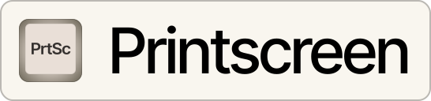

<h1 align="center">
	 
	Printscreen, the open-source website screenshot API.
</h1>

<h3 align="center">
	Integrate website screenshots in your application in minutes, for free.
</h3>

	
	   
	

	<a href="https://printscreen.gg"><b>Learn more »</b></a>

----

More content coming soon.
